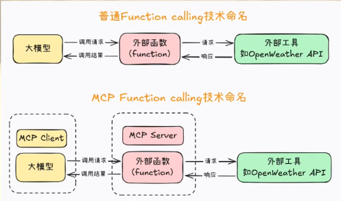
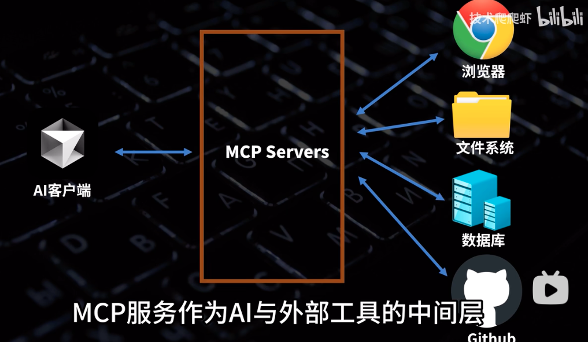
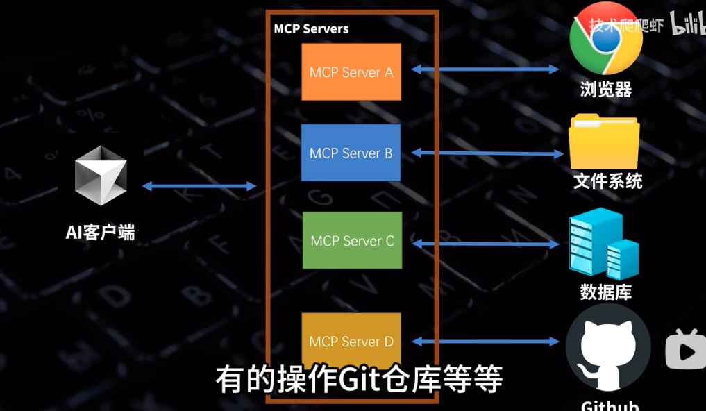

# Tutorials
Good tutorials in my journey
# Function calling
- JSON Schema（功能说明）
- 精心设计一个提示词模版才能提高响应的准确率

## MCP（model comtext protocal）
### 宏观概念
- 可以认为它就是AI标准化的工具箱
- 目标：车同轨、书同文（这种方案在技术领域就被称作协议）
- 统一FunctionCalling的运行规范

    - 大模型的运行环境称作MCP Client
    - 把外部函数运行环境称做MCP Server
- 统一MCP Client和 Server的运行规范，并且要求MCP客户端和服务器之间也同意按照某个既定的提示词模版进行通信，
    - 可以避免MCP服务器（外部函数）的重复开发，例如查询天气、网页爬去、查询本地MySQL数据库这种通用的需求，大家有一个人开发了服务器就好，开发完大家都能复制到自己的项目里来使用。不用每个人每次都单独写一套。这可是促进全球AI开发者共同协作的好事儿。很快Github上就出现了海量的MCP开发服务器，从SQL数据库检索、到网页浏览信息爬去，从命令行操作到店、到数据分析机器学习建模
    - 制药本地运行的大模型支持MCP协议，也就是只要安装了相关的库，仅需几行代码即可介入这些海量的外部工具。
- 各种协议的目标都是希望通过提高协作效率来提升开发效率。MCP就是一种旨在提高大模型Agent开发效率的技术协议。
- 既然是协议，那么必然是用的人越多才越有用。因此，为了进一步普及这个协议，Anthropic还提供了一整台MCP客户端、服务器开发的SDK，也就是开发工具，并且支持Python、TS和Java等多种语言。
    - 借助SDK，仅需几行代码就可以快速开发一个MCP服务器，然后就可以把它介入人意一个MCP客户端来构建智能体。
    - 如果愿意，还可以把MCP服务器分享到社区。给优需求的开发者使用。
    - MCP客户端不仅支持Claude模型，也支持任意本地模型或者在线大模型。
### 技术原理
- MCP的解释可以看下面这个图

- 每个Server都可以专注于某一类任务

- 通常就是运行在本地的一段nodejs或者python程序。
    - 大模型通过操作系统的stdio，也就是标准输入通道调用某个MCP Server
    - MCP Server接到请求后，通过自己的代码功能或者使用API请求，访问外部工具，完成任务。
    - MCP的最大优点在于整合各家大模型不同的function call 标准
    

