# Torch2Ascend 
## PyTorch全景&NPU介绍
- 有一个PyTorch Adapter
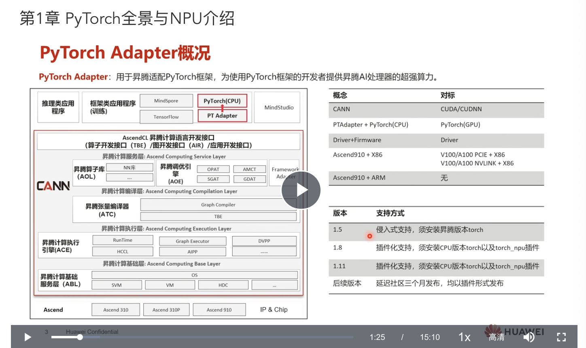

    - 原生PyTorch目录结构
    - 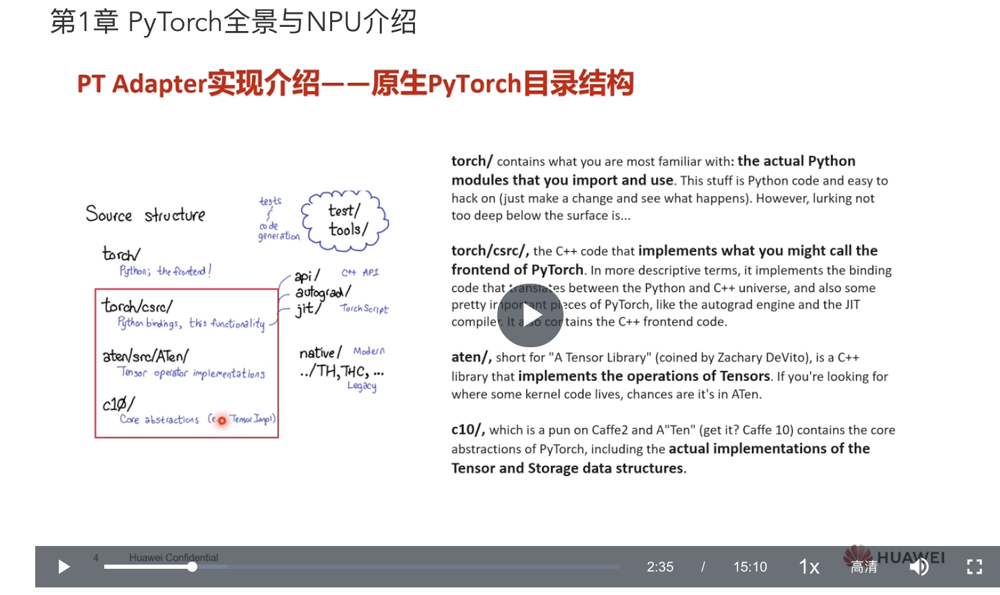

    - 单算子调用流程, CPU和GPU调用，根据Tensor的类型
    - 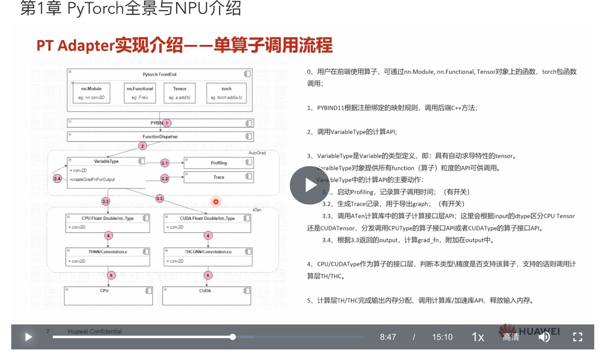
        - 根据上述机制，只需要在注册一下？然后就可以运行到NPU上？
    - 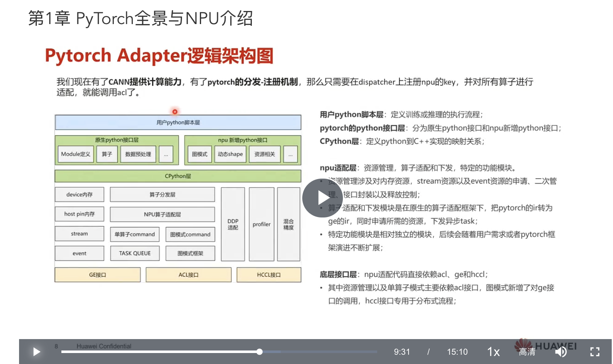
    

## PyTorch模型迁移指导
1. 算子满足度分析
2. 手工迁移(单Device、分布式)
3. 自动迁移
- 整体流程
- 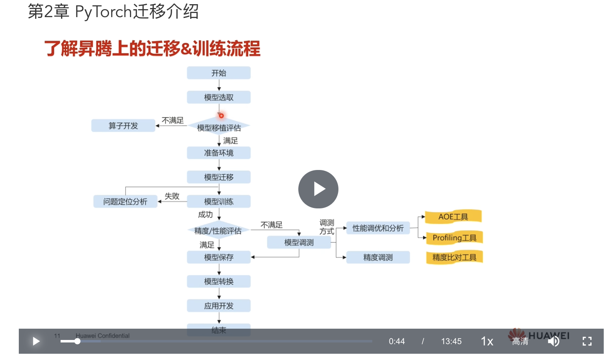
### 算子满足度分析
- 两种方式
- 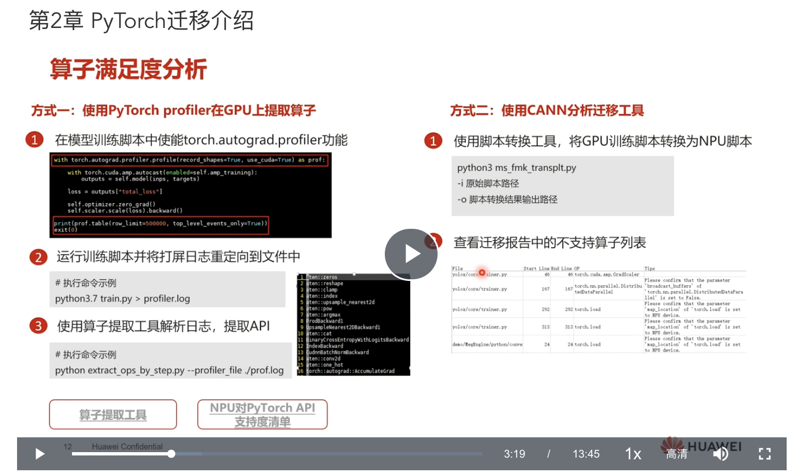
    - 据说百分之九十多的算子都支持，很难遇到不支持的算子。
### 准备环境
- 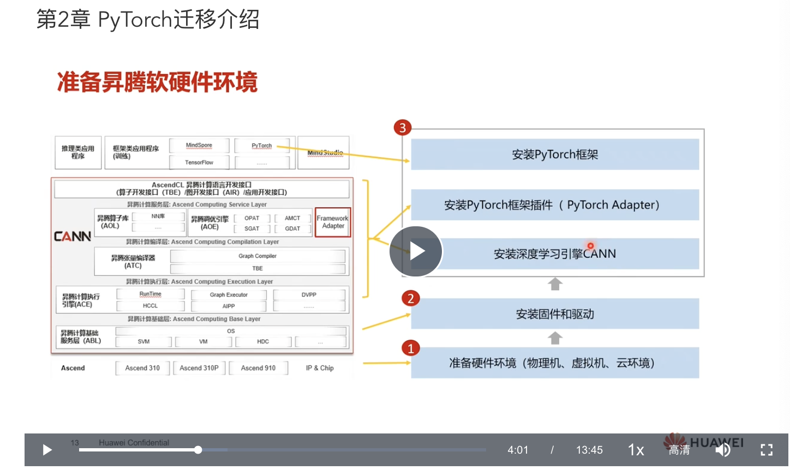
- PyTorch Adapter 目前是以插件的方式提供，想要合并进PyTorch暂时不成功
###模型迁移的两种方式：自动迁移、手动迁移
- 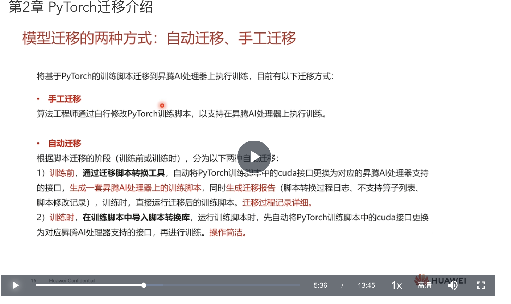
#### 手工迁移
- 单GPU
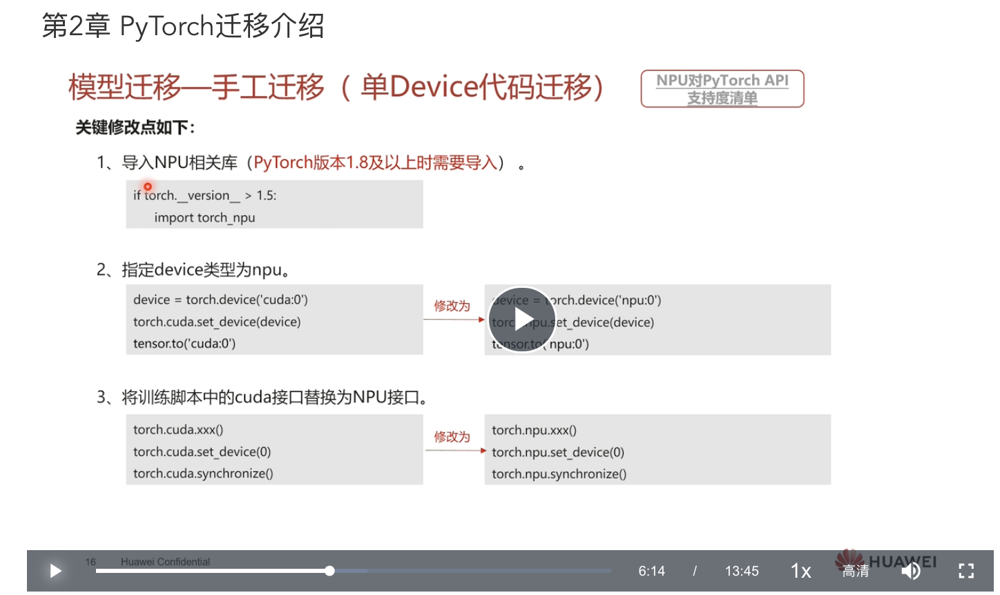
- 分布式
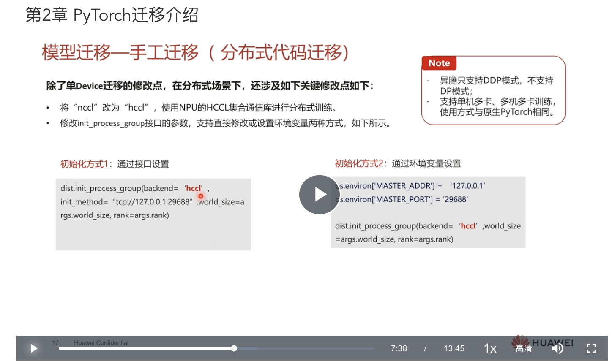
#### 自动迁移
- 迁移脚本转换工具

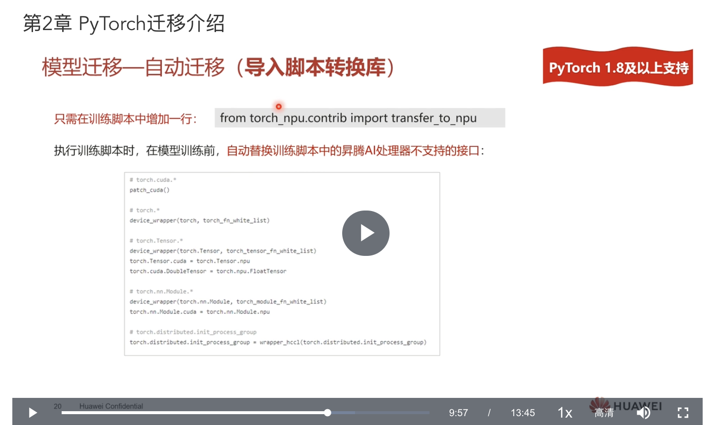
#### 模型迁移-混合精度
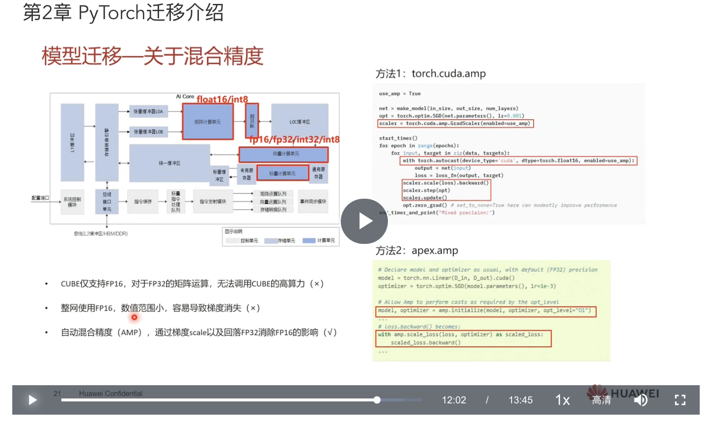
